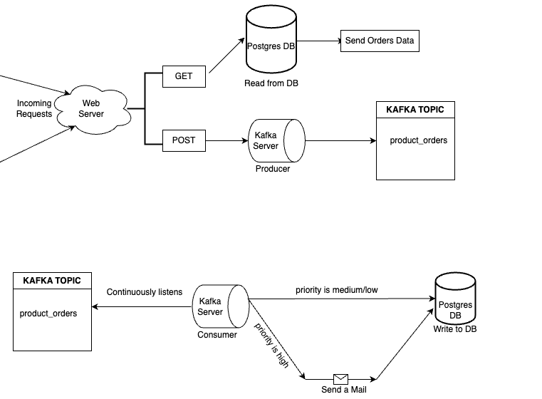
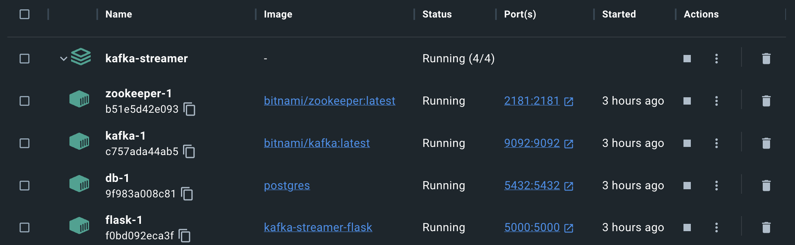
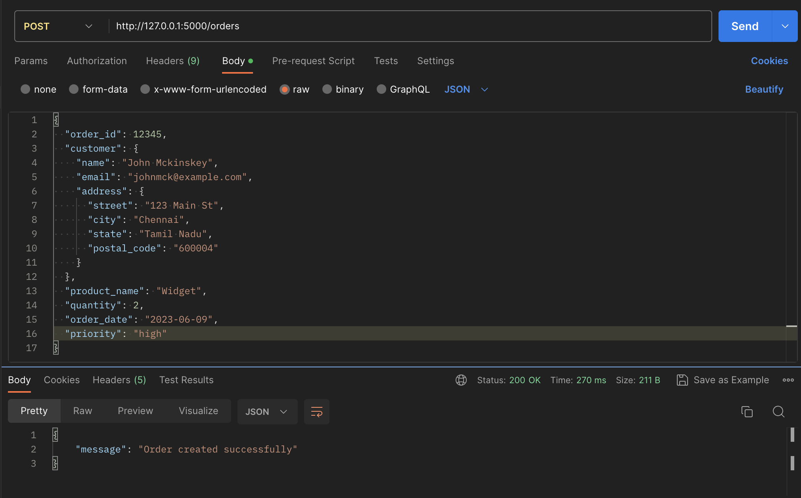
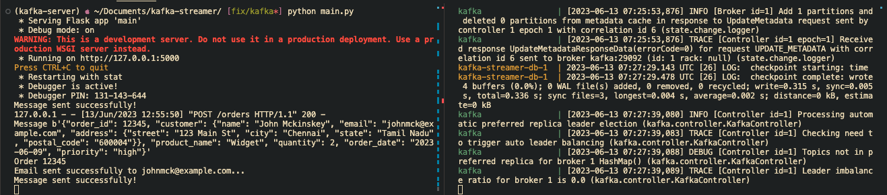
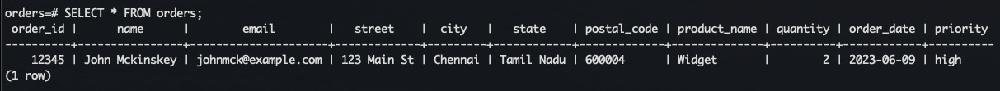

<p align="center">
  <a href="https://github.com/CIPHERTron/kafka-streamer/">
    
  </a>

  <h3 align="center">Kafka Streamer</h3>

  <p align="center">
    A microservice that uses Kafka to listens to an event involving order creation and then insert the product orders to a PostgreSQL database.
  </p>
</p>

<!-- TABLE OF CONTENTS -->
<details open="open">
  <summary>Table of Contents</summary>
  <ol>
    <li>
      <a href="#about-the-project">About The Project</a>
      <ul>
      </ul>
        <li><a href="#built-with">Built With</a></li>
    </li>
    <li>
      <a href="#getting-started">Getting Started</a>
      <ul>
        <li><a href="#prerequisites">Prerequisites</a></li>
        <li><a href="#running-the-project">Running the project</a></li>
      </ul>
    </li>
  </ol>
</details>

## ℹ️ About The Project

**Kafka Streamer** is a microservice that uses Kafka to listens to an event involving order creation and then insert the product orders to a Postgres database. The database operations are carried out using a DB sink connector which reads _product_orders_ topic and writes the data to a table called **orders** in Postgres DB.

The overall goal of the assignment is to build a system that accepts product orders, stores them in a PostgreSQL database, forwards them to city-specific topics in Kafka, and sends an email to customers for high-priority orders.



### 🛠️ Built With

Following technologies and libraries are used for the development of this
project.

- [Python](https://www.python.org/)
- [Flask](https://flask.palletsprojects.com/en/2.3.x/)
- [Kafka](https://hub.docker.com/r/bitnami/kafka/)
- [PostgreSQL](https://www.postgresql.org/)
- [Docker](https://www.docker.com/)
- [Docker Compose](https://docs.docker.com/compose/)
- Shell/CLI

<!-- GETTING STARTED -->

## 📌 Getting Started

To setup the project locally follow the steps below

### 💻 Prerequisites

- [Docker](https://docs.docker.com/get-docker/)
- [Docker Compose](https://docs.docker.com/compose/install/)
- Terminal

### 🤖 Running the project.

1. **Fork** and **clone** the project to your local system
2. cd into the project and run

```shell
docker-compose build --no-cache
docker-compose up
```

3. Then we have to create a table in postgre by running the following commands:

```shell
docker ps -a

<!-- copy the container id of db container -->

docker exec -it <container_id> /bin/bash

psql -U pritishsamal -p 5432 -h localhost -d order

<!-- Now run the following query: -->

CREATE TABLE orders (
  order_id SERIAL PRIMARY KEY,
  name VARCHAR(255) NOT NULL,
  email VARCHAR(255) NOT NULL,
  street VARCHAR(255) NOT NULL,
  city VARCHAR(255) NOT NULL,
  state VARCHAR(255) NOT NULL,
  postal_code VARCHAR(10) NOT NULL,
  product_name VARCHAR(255) NOT NULL,
  quantity INTEGER NOT NULL,
  order_date DATE NOT NULL,
  priority VARCHAR(255) NOT NULL
);
```

Then if you run `\dt`, you'll be able to see a table named **orders**

4. Now, let's exec into kafka container & create a topic named `product_orders`. Run the following commands:

```shell
docker ps -a

<!-- copy the container id of kafka container -->

docker exec -it <container_id> /bin/bash

cd /opt/bitnami/kafka/bin

./kafka-topics.sh --create --topic product_orders --bootstrap-server localhost:9092 --partitions 1 --replication-factor 1

<!-- The following command will list the topics -->

./kafka-topics.sh --list --bootstrap-server localhost:9092

<!-- To run the consumer and see what events it is listening to in real-time, run -->
kafka-console-consumer.sh --topic "product_orders" --from-beginning --bootstrap-server localhost:9092

<!-- To run the producer for testing purposes and publish dummy orders, run -->
kafka-console-producer.sh --topic "product_orders" --bootstrap-server localhost:9092
```

5. Now we have the server, broker as well as the database up and running.



6. If visit [127.0.0.1:5000](http://127.0.0.1:5000), you'll find the flask server running in this port. Now open postman and send a `POST` request to _127.0.0.1:5000/orders_ with the following payload:

```json
{
	"order_id": 90123,
	"customer": {
		"name": "James Clark",
		"email": "james@gmail.com",
		"address": {
			"street": "Avenue Street",
			"city": "Illinois",
			"state": "Chicago",
			"postal_code": "768987"
		}
	},
	"product_name": "Protein Powder",
	"quantity": 5,
	"order_date": "2023-06-09",
	"priority": "high"
}
```

7. When we send a `POST` request to `/orders` endpoint, the following set of events are carried out:

- the json is extracted from request body
- then, it will call `publish_to_kafka_topic` function to initialize a producer and send data to the kafka topic _product_orders_
- Since the consumer is always running in a separate thread, it'll be able to listen whenever any new order is added to the _product_orders_ topic via the `consume_and_send_emails` function
- In this function, first the consumer is initialized and then we iterate through the `consumer` variable.
- We then check the `priority` of the order. If it is high then we call the `send_email` function and then call the `save_order_to_postgres(order)` to write to db else directly write to db if priority is medium or low.
- Once it is added to database via consumer, we then extract the `city` from the `order` object and invoke `create_topic_if_not_exists` function. This will create a new topic with the name of the city if not already present.
- Once the respective city topic is created, `publish_to_kafka_topic` function will be called which will publish the order to it's respective city topic.
- At last, the api will return a success message

8. If we send a `GET` request to `/orders` endpoint, it will simply establish connection with the db and then get all the orders and send it in the form of a json.

### 📉 Relevant Screenshots:

1. _Sending a POST request to **/orders** via Postman_
   

2. _Logs of Docker Compose(Kafka, zookeeper and database) and Flask server_
   

3. _Exec into db and query the data added by consumer_
   
